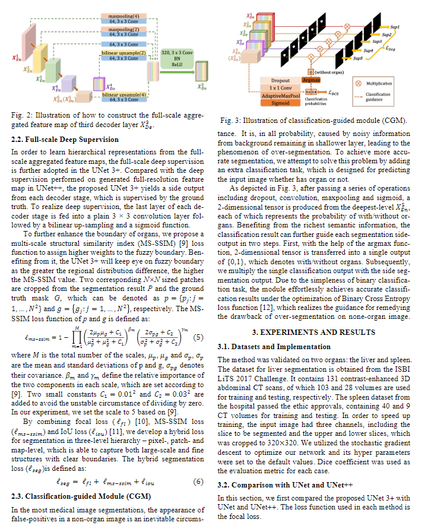
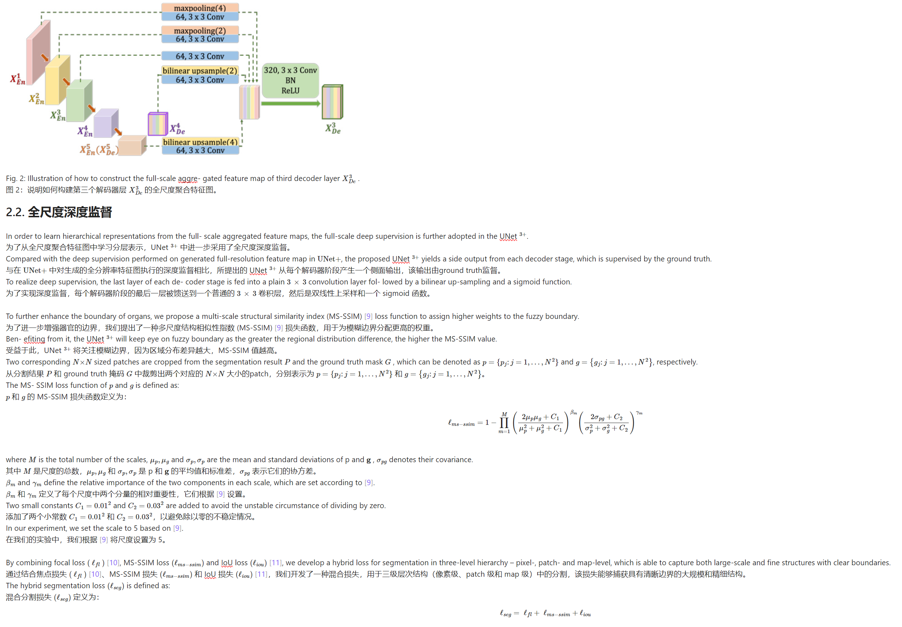
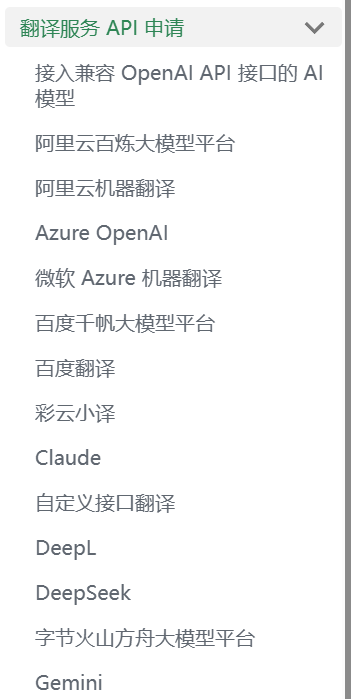
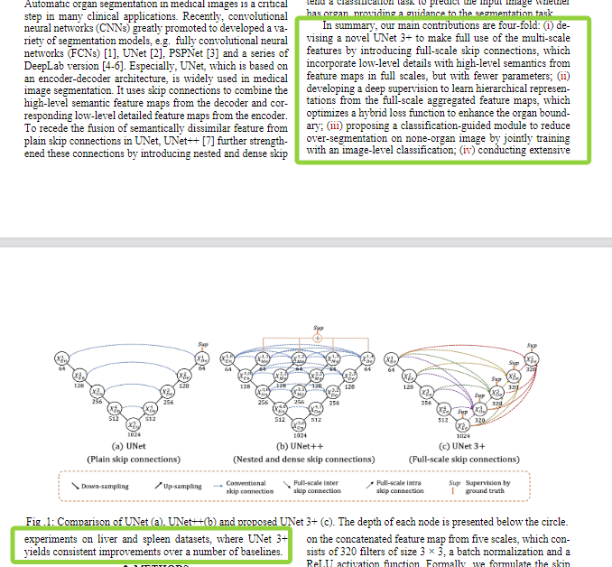

# 项目简介

SentenceAlignFidelity 能够一键将 PDF 论文翻译为逐句对照的 Markdown 文档，并保留公式、图表等特殊元素的排版，**在翻译质量、翻译速度、开销上实现了完美平衡**

项目本身免费开源，通过白嫖 API 可以实现完全免费，或低开销、按量付费

- 基于正则表达式，块式解析 MarkDown 文本
- 采用案例引导、多轮对话、流式输出、章节并行的方式调用 LLM 执行逐句对照式翻译，同时实现高质量、高速度、低开销
- 完美保留公式、代码块、图片、表格等特殊元素
- 支持接入所有主流大模型 API
- 整合了 Mistral OCR 作为 PDF 转 Markdown 工具

# 效果演示

这是原本的 PDF 论文




运行本程序，可以**一键翻译**为：**逐句对照、完美兼容公式和图表、高质量、可编辑翻译的 Markdown 文本**




# 快速入门

仅需三步配置，即可使用

## Step1 将 PDF 转为 Markdown

选择以下任意以一种方法，将你的 PDF 论文转为 Markdown 格式

### 使用 Mistral OCR 大模型（推荐，免费，本项目已集成）

> 参考文档：[免费使用 Mistral AI 并将其添加到 Dify 中使用 - 53AI-AI 知识库|大模型知识库|大模型训练|智能体开发](https://www.53ai.com/news/dify/2024102787312.html)

首先我们访问 Mistral 的控制台（https://console.mistral.ai/），如果你还没有账号的话需要先注册一个账号：

- 可以选择使用 Microsoft 账号


注册好之后登录，我们就可以看到 Mistral 的控制台，点击左侧菜单的  **Billing**  即可看到它的免费计划：


开通时只需要手机接收验证码即可，国内手机也可以使用，但验证码的发送可能会有几分钟延迟，请耐心等待

接下来我们再到 API Keys 页面创建一个 API Key：


注意！注意！注意！创建好的 key 需要粘贴复制下来，保存在本地，因为关闭之后就不会再进行展示了！

本项目已集成了Mistral OCR，将API key填入`LLM_API.py`的`Mistral_OCR_API`中，即可自动启用PDF转Markdown功能

### 使用 Doc2x（推荐，效果好，签到可得额度）

[Doc2X](https://doc2x.noedgeai.com/)

### 使用 MinerU（免费在线网页&免费开源项目）

在线网页转换：[MinerU](https://opendatalab.com/OpenSourceTools/Extractor/PDF)

或者本地部署开源项目，参考项目地址：[opendatalab/MinerU: A high-quality tool for convert PDF to Markdown and JSON.一站式开源高质量数据提取工具，将 PDF 转换成 Markdown 和 JSON 格式。](https://github.com/opendatalab/MinerU)

### 使用 Marker（免费开源项目）

```
pip install marker
```

参考项目地址：[VikParuchuri/marker: Convert PDF to markdown + JSON quickly with high accuracy](https://github.com/VikParuchuri/marker)

## Step2 准备大模型的 API Key

**使用的大模型越智能，翻译效果越好，格式越规整**

如果你没有大模型的 API，大部分大模型注册时都会赠送很多使用额度
参考沉浸式翻译提供的帮助文档，获取你心仪的大模型 API Key：[翻译服务 API 申请 | 沉浸式翻译](https://immersivetranslate.com/zh-Hans/docs/services/)



本项目支持所有与 OpenAI curl 兼容的大模型 API，已知兼容的大模型如下

| 大模型提供商  | 模型举例                            | 福利                       |
| ------------- | ----------------------------------- | -------------------------- |
| DeepSeek      | deepseek_chat                       | 注册送免费额度，收费也不贵 |
| 通义千问      | qwen-plus                           | 注册送免费额度             |
| 智谱清言      | glm-4-plus                          | 注册送免费额度             |
| Google Gemini | gemini-2.0-flash                    | 据说可以白嫖               |
| OpenAI        | gpt-4o                              |                            |
| Azure         | gpt-4o                              |                            |
| OpenRouter    | deepseek/deepseek-chat-v3-0324:free |                            |

## Step3 填入 API key，启动程序

安装 Mistral OCR 所需的库

```
pip install mistralai
```


请在`LLM_API.py`中填入 API key，包括用于将PDF解析为Markdown的 Mistral OCR 的 API Key 和用于翻译的 LLM 的 API Key

> [!warning]
> 若不填入 Mistral OCR 的 API Key，则无法对 PDF 进行直接翻译，只能翻译 Markdown 文件

配置完成后，运行`Translate.py`即可

代码会检测可用的大模型，若你配置了不止一个大模型，则会提示你输入对应数字进行选择

然后会弹出文件选择框，你可以选择 PDF 格式的论文和 Markdown 格式论文，支持多选（Ctrl+鼠标点击）

- 若选中了 PDF 格式论文，并正确配置了 Mistral OCR，则先会将 PDF 解析为 Markdown，然后再执行翻译
- 若选中了 PDF 格式论文，但未配置 Mistral OCR，该论文不会被处理
- 若选中了 Markdown 格式论文，则直接开始翻译

## 运行说明

程序将 Markdown 中的一级标题视为 1 个章节，每个章节独立并行翻译，并行度取决于`LLM_API.py`中配置的`max_concurrent`值

程序默认一篇论文不可能只有 1 章，若检测到文章只含 1 个一级标题，则会尝试自动调整标题层级

在正式开始翻译后，将分章节实时输出翻译结果，每个章节对应的文件名为`block_章节编号_论文名`，输出位置与论文文件相同，你可以点击对应章节来实时查看结果

在所有章节翻译完成后，程序将合并子章节的内容至最终输出文件中，名为`论文名_逐句对照`

>关于异常断行

PDF 转 Markdown 的结果不总是完美的，由于分页和图表等原因，论文的某些段落可能会被分开，而这难以被正确处理，导致转换后的 Markdown 中段落不连续，我将其称之为异常断行

例如下图中，两个绿框的内容其实属于同一段落，但由于分页和图表排版，他们被强行分开了



翻译以段落为基本单位，这或多或少会影响准确性（实测影响很小）

在翻译完成后，程序会在最终文件中，根据标点符号输出对异常断行的分析结果，显示可能未被正确分段的段落信息，你可以参考并修正

# 有效性威胁

- PDF 转 Markdown 可能并不完美，可能存在公式识别错误、图表错位缺失等问题，实测[Doc2X](https://doc2x.noedgeai.com/)效果最佳，效果接近满分
- 逐句翻译由大模型完成，偶尔可能抽风，添油加醋，或输出的文本不符格式，但实测概率较低，且均能完成最基本的翻译需求
